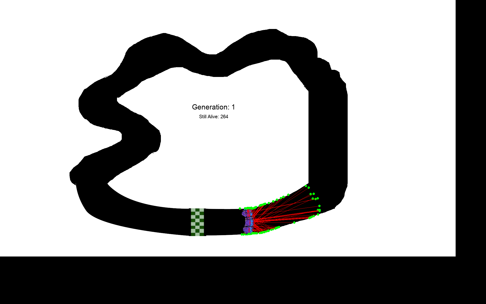
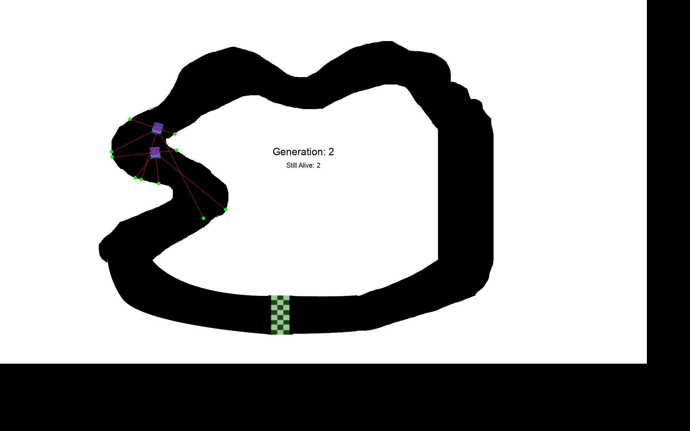
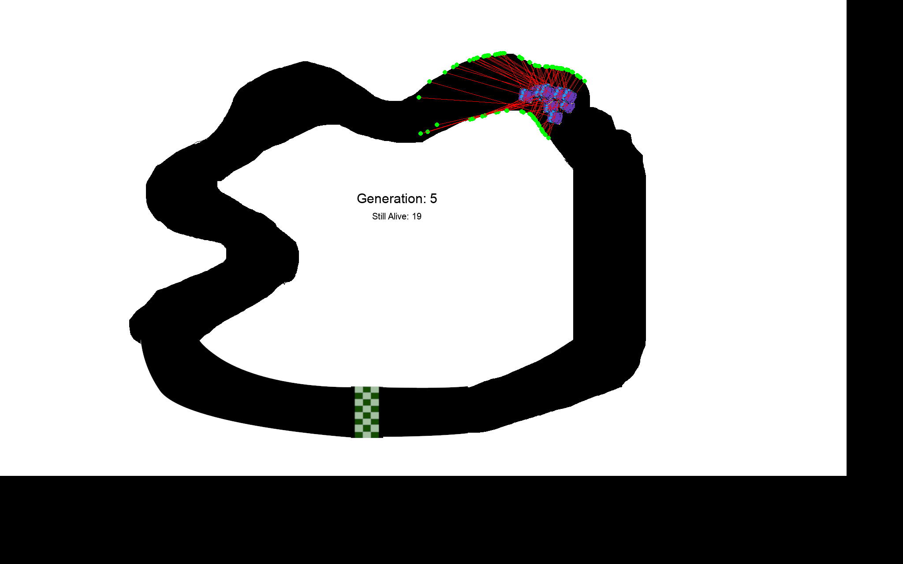
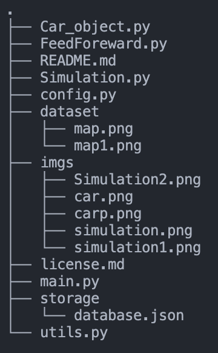
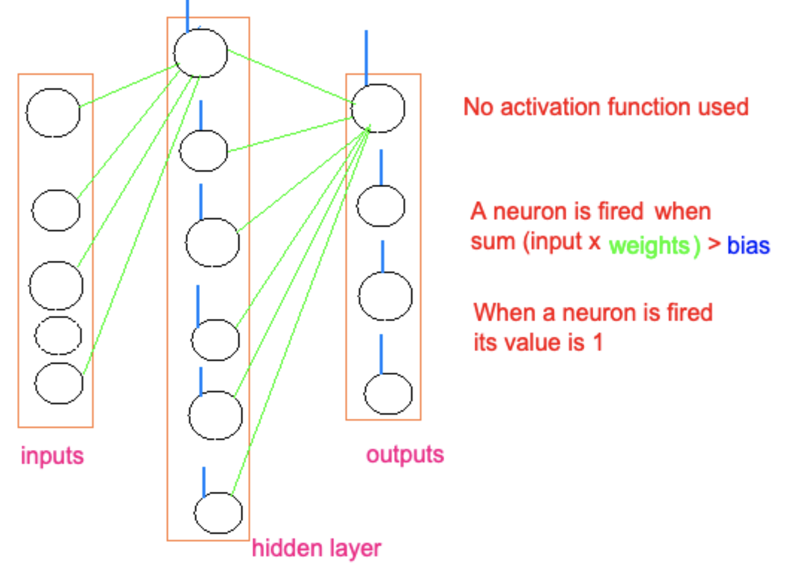
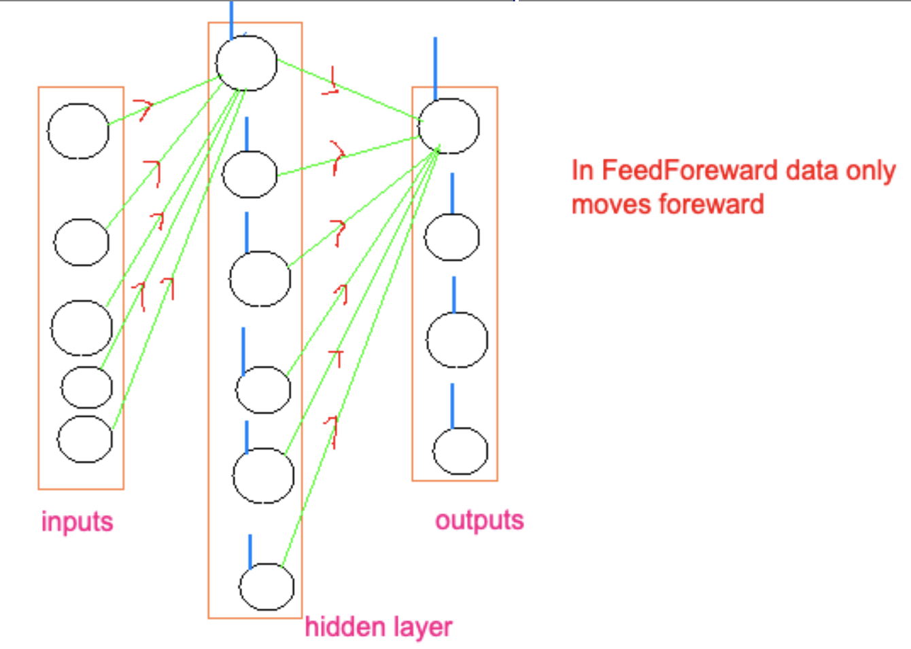
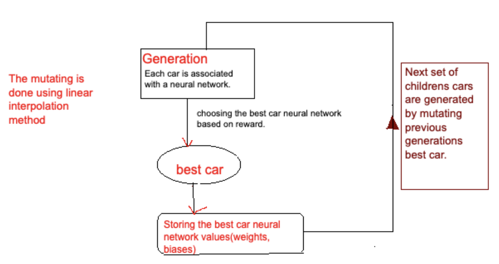

#### Author : [vivekdhir77](https://github.com/vivekdhir77)
<a href="https://www.python.org" target="_blank">  </a>


#### <u>Categories</u>: Python(v3.8.5), Machine-Learning, pygame(v2.1.2), Neural-Networks

# Contents
- <b>About<b>
- <b>Instructions<b>
- <b>File Structure<b>
- <b>Neural Network (explanation)<b>
- <b>Genetic Algorithm explained<b>


## About

# AI car training simulation
#### <u><b>UNIQUENESS</b></u> : This project is made using Feedforward Neural network (`without using any machine learning library`)






## Instructions

1. Clone the repository <br> 
```
$git clone https://github.com/vivekdhir77/AI-Car.git
```

2. navigate to this folder <br>
3. Install pygame
```
$pip install pygame
``` 

4. Run main.py <br>
```
$python main.py
```

## File structure


- `main.py`

- `config.py` - Contains all initial Configuration of the project. You can tweak the default configuration(eg: max speed of car, speed, rotation rate, mutation rate...) and try out the code.

- `storage/database.json` - (Initially you can empty this file) In this file the project stores the weights and biases of the best car in every generation. 

- `FeedForward.py` 
    - <u>Class:</u>
        - NN : This is the neural network class
            - <u>Methods</u>
                - feedForward(self, givenInputs, network) : Returns output for the Neural network for the given inputs (The inputs essentially are the distance between car and border - radars outputs)
                    - parameters: Takes a network object (class: NN), Inputs (radars outputs)
                <br>
                - mutate(self, network, amount = 1) : Once stored Detalis about weights and biases of a particular generation we use linear interpolation to mutate by some rate so that we might possibly get a better car.
                    - parameters: Takes a network object (class: NN), Mutation rate
        - Level : This is a supporting class for the Class NN.
            - <u>Methods</u>
                - __init__(self,inputCount,outputCount, ind) : Initialising weights and biases to random values between [-1, 1] if the database is empty
                    - parameters: Takes no. of inputs, no. of outputs, (ind) layer index
                <br>
                - feedForward(self, givenInputs,level) : FeedForward's layer by layer
                    - parameters: Takes givenInputs (class: NN), level

- `Car_object.py` - It has the car class with the follwing methods
    - draw(self, screen) - Draws the car 
    - draw_radar(self, screen)
    - update_corners(self)
    - update_Xpos(self)
    - update_Ypos(self)
    - check_radar(self, degree, game_map)
    - get_data(self)
    - is_alive(self)
    - get_reward(self)
    - check_collision(self, game_map)
    - rotate_center(self, image, angle) - Supporting function to help rotate the car

- ` Simulation.py` - here we just have 1 method which does the simulation by connecting all parts of code. 
    - To start with: Here we initialised with some number of cars and correspondingly each car has a neural network assigned to it. Then we found the best car using some reward metric (Distance travelled by each car). We store the NN of the best car in the database to reuse in the next generation by mutating with some rate. 
        - What is storing the NN? It is storing the weights and biases of the neural network.

- `utils.py` - It has supporting functions
    - logs(current_generation,Best_car,  nets, cars) : It prints the logs i.e the values (weights, biases) of the best car's NN in every generation
    - move(cars,nets) : It move the car by using the outputs given by respective neural network
    - keyboard() : Initially we tested the car movements using keyboard inputs (not used by the code anymore)

- `license.md` - contains license
- `README.md` 

## Neural Network (explanation) 

#### This section give the detailed explanation of neural network implementation used the project

- Our neural network architechure 
    - 5 input nodes, 1 hidden layer (6 nodes), 4 output nodes

    - The 5 radar readings are the inputs.
    
    - The 4 outputs indicate moving forward, backward, left and right.

    - The outputs nodes return either 0 or 1

    
    

    - Why did we use FeedForeward neural network?
        - Simple Architechure

## Genetic Algorithm

- In the genetic algorithm part we have 2 main parts (mutating and crossover). In this project we are just using mutation.
- The below image gives the overview of the code flow


    
